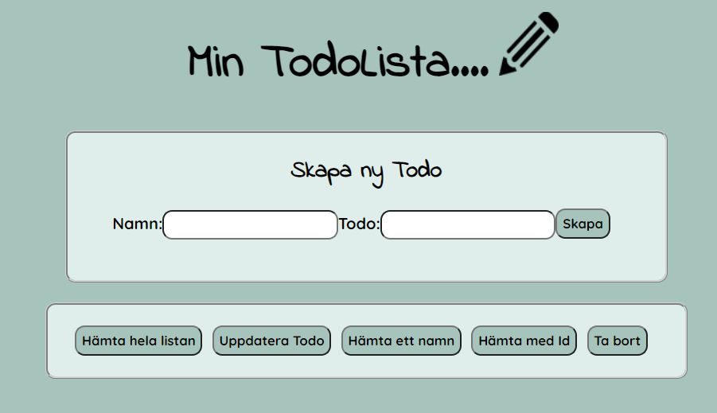
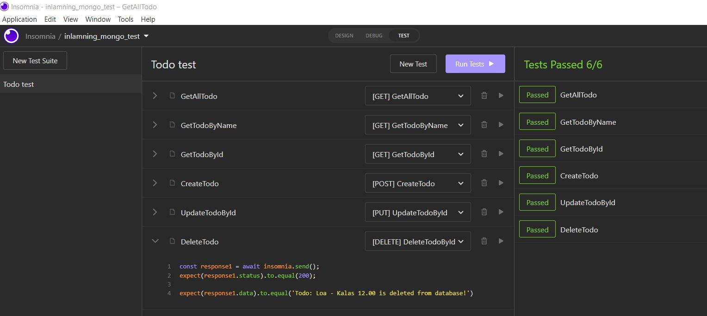

## Dokumentation - Datalagring
Vi har skapat ett fullstack projekt med hjäp av, Docker, MongoDB, Mongoose, React.

Detta är min nya frontend, tog inte den från förra inlämningen.

Testerna i Insomnia går igenom.

### Beskriv lite olika lösningar du gjort.

I förra inlämningen ligger alla crud funktioner under varandra. Denna gången valde jag att slå ihop flera och lägga dom
med en knapp och sen med ett popup window. Jag googlade fram en tutorial på en enkel popup-window och skrev om den så
den passade min css. Jag ville skapa en annan css och utmana mig själv.

Lars gick igenom hur man skapade ett globalt id, som ska underlätta om någon ska kolla testerna i backend. Eftersom
databasen är tom så ligger createTodo testet först i min testfil.

### Beskriv något som var besvärligt att få till.

Jag stötte på problem när jag skulle koppla ihop min backend med min frontend, jag hade missat att tex skriva in rätt
url. Hade även fel när jag gjorde skapade mina todos. Dom hamnade en egen collection än den jag hade skapat. Men då
hittade jag felet i min TodoModel.js jg hade missat att skriva i ett , mellan "databaseCollection TodoSchema".

### Beskriv om du fått byta lösning och varför i sådana fall.

Jag hade en Middlewares och en ApplyMiddlewares men insåg att jag kunde lägga allt jag hade i ApplyMiddlewares i
Middlewares så fick jag bara en fil istället för två. Enklare att städa upp i backend och mindre filer att ha koll på.

### Beskriv hur du felsökt ditt program när det uppstått problem

För att se om min backend har vart igång och gör det jag förväntar mig att göra så har jag använt mig av Insomnia. Det
har även varit endel console.log i koden för att se vad det är som kommer ut.

På frontend så har det varit mycket i inspectorn och i terminalen.

## Utvärdera din inlämning:

### Vad gick bra

Det gick lite enklare denna gången att skriva en backend än i förra inlämningen. Fastnade inte lika mycket på mina crud
denna gången ch det gick fortare att få ut rätt i Insomnia.

### Vad gick dåligt

Det har varit svårt att koppla ihop hela frontend, då insomnia släpper igenom saker som inte React gör. Tex när jag vill
få ut ett meddelande att en Todo inte finns. Det har synts i Insomnia som det ska men på frontend kom det ut
felmeddelande i inspectorn eller hela sidan blev vit. Det har gjort att jag har fått gå tillbaka i backend och göra om
mina message till tex en sträng eller en array för att frontend förväntar sig det.

### Vad har du lärt dig

Jag har lärt mig hur man kopplar ihop en databas med mongoose. Egentligen ingen jättestor skillnad från ett restApi som
i förra inlämningen. Men det verkar mycket smidigare med MongoDB och Docker än sålänge. Jag har fått kolla flera gånger
om Docker är igång för att min backend inte går igång. MongoDb ser jag många fördelar med, då det är enklare att lägga
till/uppdatera/ta bort ett object, allt ligger i samma program och det är enkelt att söka efter något.

### Vilka möjligheter ser du med de kunskaper du fått under kursen.

I början av kursen fick vi en inblick av hur SQL fungerar, vilket är en bra erfarenhet. Men det blev mycket enklare när
vi gick igenom MongoDb. Då behöver man inte ha koll på tabeller och koppla med en pk och fk. Med denna kunskap så ser
jag att jag kan sätta ihop ett helt fullstack projekt på egen hand. Jag skapar min egen databas och och kopplar ihop det
med min backend/frontend. Det ger mig kunskap om båda sidorna, vilket kan vara bra när man kommer ut i arbetslivet att
man arbetat och gjort ett helt fullstack projekt.

### Motivera varför du valt en specifik lösning.

Jag valde att ha kvar min Alive funktion, för då är det lätt att se om backend svarar mot frontend.

### Lämna förslag på förbättringar av din kod.

Jag har följt koden som vi har gått igenom på lektionerna och även i Arastos video, så min backend tror jag är
strukturerad på ett bra sätt. Dock på min frontend så tror jag att jag kan lägga mer css globalt, nu ligger det i module
till nästan varje component.

### Lämna exempel på lösningar du valde att inte implementera

Jag tror det hade varit snyggare med en bock eller liknande. Men jag valde att ha kvar min överstrukning när en todo är
färdig. Men fick hjälp av Lars att skriva om den förra koden med togglesDone så att den fungerar till denna nlämning.

### Lämna förslag på förbättringar av din UI/UX design eller reflektera över den.

I min "Hämta alla" lista, så skapade jag en scroll. Det va för att hade jag för många todo i listan så gick dom utanför
popup windows och dolde min stängknapp. Då valde jag att lägga till en scroll funktion istället. Dock har jag inte fått
till css:en som jag vill ha den, men jag la till den funktionen för att mina todo inte skulle gå utanför. Nu funkar den
som den ska även om den inte ser ut som jag vill.