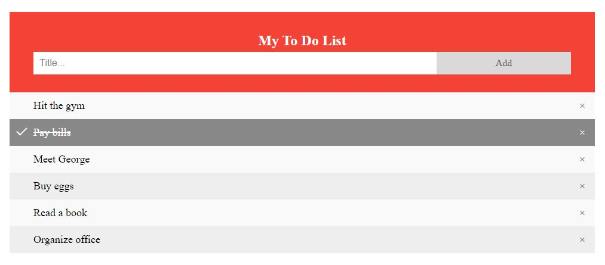
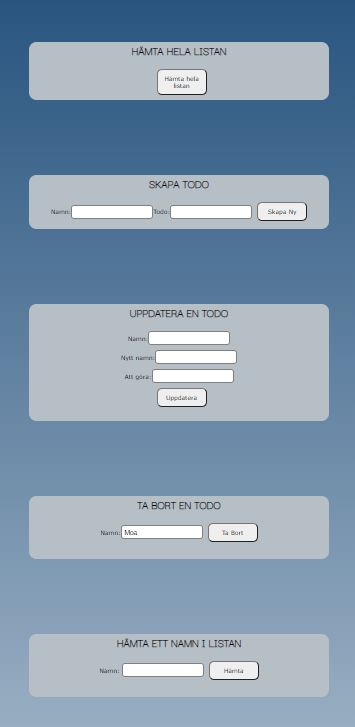

## Dokumentation

I denna kurs ska vi skapa en enklare Backend med ett RestApi som ska kopplas till en Frontend. Det ska även finnas
enklare tester i Insomnia/Postman. Api:t innehåller en todo-list och ska skapas enligt CRUD-principen.

Jag har valt att använda Trello till min projektplanering.

### Beskriv lite olika lösningar du gjort.
Min tanke från början va att skapa en bättre Frontend genom att försöka slå ihop crud funktionerna. Efter mycket om och
men så insåg jag att jag inte är där i det logiska tänket. Jag är säkert på rätt väg, men får inte ihop det och kan
knyta ihop säcken. Därför ligger funktionerna var och en försig i min Frontend.

Jag valde att bara använda mig av en överstrykning av texten när varje todo är färdig. Jag ville ha en bock istället,
men fick inte till det heller. Det är fortfarande endel med det logiska tänket som gör det svårt för mig att koppla ihop
allt.

### Beskriv något som var besvärligt att få till.

Jag har haft svårt att kunna skriva ut i frontend. Jag har missat flera gånger att url:en inte stämmer överrens i
Backend/Frontend och då hittar dom inte varandra. Det har även varit svårt att bryta ut alla componenter i Backend, då
importerna har krånglat.

Testerna i Insomnia va kluriga att få till. Speciellt när man skulle testa " update" för då la den hela tiden till ett
nytt object i arrayen och testerna ovanför blev failade istället. Hade även stavat fel eller glömt en .() på något
ställe som jag inte hittade från början som gjorde att testerna inte gick igenom. Små saker eller små fel som kan ställa
till det.

Även testerna i av endpoints tyckte jag va svåra att få till. Jag tappade bort mig flera gånger med () => {} eller att
jag hade glömt av att skriva done(). Även samma här att jag fick gå tillbaka och titta så det va samma url osv.

### Beskriv om du fått byta lösning och varför i sådana fall.

På lektionerna har vi använt oss av " const () => {} ". Jag försökte byta ut dessa till " function () {}" på mina crud,
för att få en variation på kod. Tyvärr så lyckades jag inte skriva ut koden på detta sätt så jag valde att återgå till "
const (") => {}

### Beskriv hur du felsökt ditt program när det uppstått problem.

Jag har använt mig mycket mer av av terminalen i Webstorm samt att Insomnia har varit ett bra verktyg att se om Backend
gör det den ska. Det har gjort att jag inte använt mig av webbläsaren lika mycket denna gången. Har använt samma när jag
gjort de manuella testerna.

### Vad gick bra.

Jag tycker att det mesta har gått bra. Jag har lyckats att få en Backend att prata med en Frontend och kunnat skapa en
lättare design på de. Tycker även att jag har fått en större förståelse om hur allt hänger ihop, även detta med .map det
börjar sätta sig mer att det är ett sätt att mappa upp saker på. Känns som man kommit in i saker lite mer nu och kan se
en lite större helhet än innan. Även om det är många bitar som fortfarande är svåra så går det att ändå kunna läsa sig
till saker och se ungefär vad dom gör eller hur dom hänger ihop.

### Vad gick dåligt.

Ingenting har väl gått dåligt. Däremot så har små saker som stavfel, att man glömt en punkt, parantes osv. Det har gjort
att det kan kracha och så får man leta eller jämföra kod för att hitta var felet är. Det har även hänt att man haft uppe
fel server eller glöm att starta som gjort att man stött på problem. Min klasskamrat Christoffer har snappat upp detta
med tester än mig, så harn har förklarat och hjälp till att felsöka när det uppstått problem.

### Vad har du lärt dig.

Jag har lärt mig att att skapa ett api som är kopplat till en frontend. Har även lärt mig att använda Insomnia som ett
verktyg för att se om backend svarar. Har även lärt mig att bryta ut filerna i tex backend till routes, data, controller
och configuration och att det är många filer som är kopplade till varandra. Även att man kan skriva manuella och
automatiska tester i Insomnia.

Även testerna har satt sig lite mer än i förra inlämningen även om jag tycker att fireEvent fortfarande är svåra. Men de
andra enklare testerna tycker jag sitter okej.

### Vilka möjligheter ser du med de kunskaper du fått under kursen.

Jag ser att det är en god kunskap för att kunna bygga en egen webbsida. Här har jag fått grunden till hur man ska bygga
ihop backend/frontend. Att ha kunskap om båda sidorna är nog bra ute i arbetslivet, att man iallafall har sett och kan
läsa vad som händer (till viss del).

### Motivera varför du valt en specifik lösning.

Jag valde att ha kvar Alive funktionen. Klickar man på knappen så ser man direkt om backend svarar. Det blev ett enkelt
sätt mig mig att se om jag glömt att starta min server eller inte.

### Lämna förslag på förbättringar av din kod.

I min backend så har jag följt det vi har gått igenom på lektionerna. Så jag tror att utbrytningar och sånt stämmer. Det
är på min frontend som jag kan förbättra min kod. Genom att lägga ihop allt istället för att ha dom utbrutna. Jag känner
inte att jag har den kunskapen att få ihop det.

### Lämna exempel på lösningar du valde att inte implementera.

Etersom min css inte skulle skilja sig i design så valde jag att lägga den global. Hade jag däremot fått ihop det som
jag hade tänkt så hade jag använt mig av css.module istället för att css inte ska läcka igenom i andra filer.

### Lämna förslag på förbättringar av din UI/UX design eller reflektera över den.

Det är inte den snyggaste designen jag har skapat. Det är mest i brist på att funktionalliteten inte är ihop satt som
jag tänkt. Annars hade jag lägt mer tid på att få en renare design.