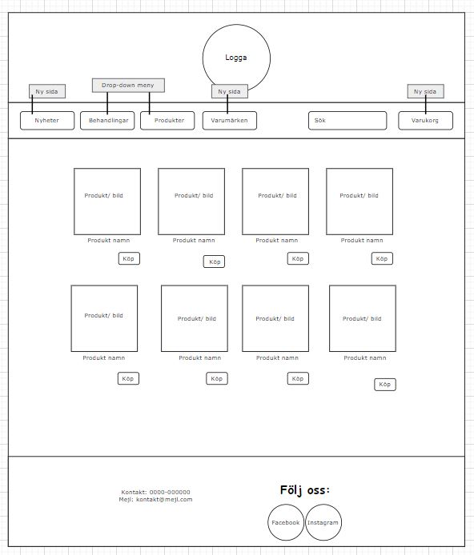

# Dokumentation

Vår uppgift var att skapa en hemsida med genomtänkt UX/UI. Jag har valt att gestalta en webshop med ekologiska
hudvårdsprodukter. Därför valde jag att använda grön i olika nyanser för att symbolisera att det är natur och att det
kan förknippas med ekologiskt.

Jag har valt att använda Trello som projektpan. Där har jag delat upp uppgiften i mindre bitar. Till mina personas och
prototyper har jag använt mig av draw.io

[Min Trello](https://trello.com/b/hJS8JSZF/gr%C3%A4nssnittsdesign)

Här ser man mina personas som är kopplade till min hemsida/webbshop.

Här kommer mina Wireframes (Low Fidelity) för desktop/table/mobile.

Prototypen i färgskala.

För att hitta bra färgmatchningar så har jag använt mig av paletter från [Flatcolors](https://flatcolors.net/)

När jag har letat efter fonter så har jag använt [Google Fonts](https://fonts.google.com/)

I detta projekt har jag använt Quicksand och Cinzel.

### Beskriv lite olika lösningar du gjort:

För det första googlade jag runt på olika webbshoppar för att får inspiration. Sedan plockade jag det som jag föll mig i
smaken och satte ihop en prototyp.

När det kommer till UX så tyckte jag att det var svårt att hitta en sida som inte enbart hade "svart/vitt" med något
färgschema. Så jag satte ihop eget efter tycke och smak. Vilket tog lite tid, för jag ville jobba med färg men samtidig
har det stilrent och inte för plåttrigt.

Jag skapade en egen logga till webshoppen för att få extra lilla touchen. Vilket jag tyckte passade för då kunde jag gå
lite hårdare på den gröna nyansen för att väcka ögats intresse. Och för att väcka ögats intresse lite mer så valde jag
att göra loggan som en gif, så det händer något.

Sedan valde jag att kategorisera alternativen i min dropdown. Så det ska bli enklare att orientera sig på sidan.

### Beskriv något som var besvärligt att få till:

Jag hade svårt att få till det responsiva på hemsidan. Jag kollade på w3 och lyckades lösa en del. Sen fick jag en
påminnelse av Christoffer att man alltid börjar i mobil läge, men jag hade glömt av det och började i desktop läge.
Vilket gjorde att jag inte fick till det responsiva för att jag tänkte åt andra hållet.

### Beskriv om du fått byta lösning och varför i sådana fall:

Jag fick ändra i table och mobil läget för det skiljer sig ifrån hur jag gjorde prototypen som man ser ovan. Och det är
helt enkelt bara för att det blir för tajt och inte snyggt på hemsidan. Jag testade men insåg att det inte såg ut som
jag egentligen hade tänkt.

### Beskriv hur du felsökt ditt program när det uppstått problem:

Jag har tagit hjälp av inspektorn för att hitta fel på min sida. Ibland dök det upp en margin som tryckte ut en bild
eller text och då gick jag in och kunde hitta felet. Det är smidigt att kunna lägga till / ta bort för att hitta felet
och då kan man se om det är det som är problemet man söker. Sedan ser man även i vilken fil det ligger i. Tex jag va
säker på att en margin låg i min style.css men den låg dubbel i navbar.css. Så antagligen har jag klistrat in den där av
misstag och glömt ta bort den. Men då kunde jag tydligt se att det låg en margin i navbar.css som gjorde att det tryckte
ut min bild.

### Vad gick bra:

Jag är över förväntan nöjd med hur jag fick till mitt UX. Jag tycker det kan va svårt att se hur det matchar när man
jobbar så mycket med samma sida. Jag känner att jag lätt blir "hemmablind". Men när jag har visat sidan för andra och
frågad tex vad dom lägger märket till först så har dom sagt loggan, och det är ju det jag ville. Annars har responsen
varit en stilren sida med harmoniska färger. Inget som direkt sticker i ögonen.

### Vad gick dåligt:

Jag testade många olika fonter och tyckte att det va svårt att hitta någon som jag gillade. Men nu är jag relativt nöjd,
men det finns för mycket att välja på. Men jag gick utefter att jag ville ha ett lättläst för ögat vid första anblick.

Annars är det som jag nämt tidigare att få till det responsiva som krånglade endel. Men det löste sig till slut.

### Vad har du lärt dig:

Jag har lärt mig skillnaden på Serif och Sans Serif. Serif har typ "fötter" och Sans Serif är mer raka linjer. Jag har
valt att använda Sans Serif för att jag tycket att det är mer lättläst.

Jag har även lärt mig hur man importerar nya fonts.

@font-face {

font-family: 'Cinzel';

src: url('../font/Cinzel/static/Cinzel-Regular.ttf')
}

Sedan hur man kan få bra tips på färdiga paletter på tex [Flat colours](https://flatcolors.net/)

Jag tog mig även tiden att designa min logga till hemsidan. Jag tog hjälp av det vi lärde oss i kursen med Leo Digitalt
skapande. Jag skapade loggan i Inkscape för att den inte ska bli pixig oavsett storlek. Sedan gjorde jag fem bilder som
jag sedan importerade till Gimp där jag la en animering på bilderna som jag sedan klippte ihop till en gif.

### Vilka möjligheter ser du med de kunskaper du fått under kursen.

Ett annat tänk hur jag ska utforma en sida åt en kund. Eftersom vi skulle göra personas till uppgiften så hade sidan
redan fått ett tema. Jag tyckte att det var lättare att lägga fokus på vilket innehåll som skulle finnas med.

### Motivera varför du valt en specifik lösning:

I navbaren valde jag att lägga "Produkter", "Varumärken och "Behandlingar" som en dropdown meny. Min tanke här är att
det ska bli lättare att orientera sig på sidan och eventuellt minska antal klick. Medans "Nyheter" och "Kontakt" bara är
en knapp för att komma till en annan sida. Där tanken är att det kommer va flytande text eller text som uppdateras så
man bara kan skrolla neråt.

### Lämna förslag på förbättringar av din kod:

Jag tycker att min kod ser relativt enkel ut att läsa. Sen hade jag nog kunnat dela upp style.css i ytterliggare en fil.
Tycker att den är lite i längsta laget nu och lite svårt att hitta. Absolut något att ta med framöver. tex en för
knappar/bilder.

### Lämna exempel på lösningar du valde att inte implementera:

Som man ser i min prototyp så hade jag skissat upp att produkterna skulle ligga fyra i rad. Men när jag skulle
implementera det så låg det för tätt ihop. Så jag valde att lägga dom två och två istället. Samma i mobil läget enligt
skissen skulle dom ligga två och två här ändrade jag till 1 så dom ligger under varandra.

Går man vidare i prototypen så kan man se att jag har valt att ha navbaren liggandes. Nu valde jag att lägga den under
varandra istället samma som i mobil läget. Detta va för att det annars hamnade på platser som jag inte ville ha det. Jag
vill ha en strukturerar sida som ska va relativ lätt att titta på.

## Sluttankar

Jag är egentligen en svart/vit person som gillar när det ser enkelt och stilrent ut. Att sätta färger som ska genomgå en
hel sida har vart en utmaning. Men jag är väldigt nöjd med mitt resultat. Det har varit roligt att jobba på ett sätt som
man gör på företag. Med en målgrupp och sen bygga utefter det. Känner själv nu i efterhand att man är lite mer
uppmärksam på andra sidor på derar UX/UI. 