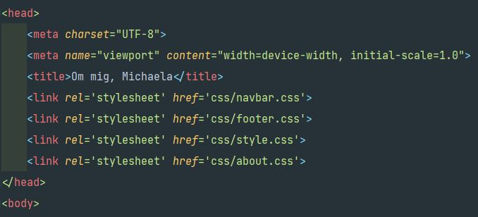

### September 2021 ###
## Dokumentation ##

Denna inlämning är baserad på 6 punkter där varje punkt innefattar en html-fil och en css-fil.

* Index
* About
* Other
* Blogg
* Courses
* Products

Mer om innehåller kan man läsa i min projektplan i README-filen eller på min Trello sida.

### Utformning/layout
Jag hade från början redan en tanke på hur jag skulle urforma min sida. Det skulle vara samma tema rakt igenom dvs bakgrundsbild, text, färger skulle vara lika på alla sidor. Därför valde jag att lägga allt detta i en egen css-fil som jag döpt till style.css, denna är då länkad till alla mina html-filer. Det som kommer skilja sidorna åt lägger jag i en separat css.fil. Navbar och footer har egna css-filer som är länkade till respektive sida. *(Temat har dock ändrats ett antal gånger under arbetets gång.)*

