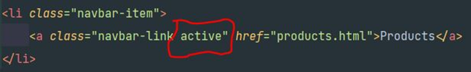

### September 2021 ###
## Dokumentation ##

Denna inlämning är baserad på 6 punkter där varje punkt innefattar en html-fil och en css-fil.

* Index
* About
* Other
* Blogg
* Courses
* Products

Mer om innehåller kan man läsa i min projektplan i README-filen eller på min Trello sida.

### Utformning/layout
Jag hade från början redan en tanke på hur jag skulle urforma min sida. Det skulle vara samma tema rakt igenom dvs bakgrundsbild, text, färger skulle vara lika på alla sidor. Därför valde jag att lägga allt detta i en egen css-fil som jag döpt till style.css, denna är då länkad till alla mina html-filer. Det som kommer skilja sidorna åt lägger jag i en separat css.fil. Navbar och footer har egna css-filer som är länkade till respektive sida. *(Temat har dock ändrats ett antal gånger under arbetets gång.)*

### Olika enheter
Jag har använt mig av media queries - @media detta är för att min sida ska kunna anpassa sig till olika enheter.
Jag har använt mig av dessa:

**Table**
@media only screen and (min-width: 768px) {

**Desktop** @media only screen and (min-width: 1200px) {

Jag har även varit inne i olika webbläsare för att se hur det ser ut, jag har använt mig av Chrome, Firefox och Microsoft Edge där jag använt mig av desktop, ipad, iphone 6/7/8 plus, iphone 6/7/8.

## Navbar/footer ##
Jag använde mig av w3 schoole för att hitta en lämplig navbar som skulle matcha det resultatet jag ville ha. Men jag stötte på problem när jag satt och designade. "Products" ville inte byta färg när jag klickade på den men man kom in i filen. Efter ett antal försök frågade jag en klasskompis om hjälp, vi delade skärm och kollade igenom min kodning. Det visade sig att jag inte hade ändrat "active" på respektive html-fil. "Products" var alltid "active" på vilken sidan jag än klickade på.

Detta va den första navbaren jag gjorde. Nu har jag tagit bort den och gjort en ny som passar det nya temat jag har valt. 

I mobil läget så tryckte navbaren ut sig och tog plats. Så jag va tvungen att ändra till en drop lista istället för att ha den liggandes som i tex desktop.

Till Footer använde jag mig också av w3 schoole för att hitta koderna och designa själv. Även här stötte jag på problem. Eftersom jag till en början hade valt att ha genomskinlig footer med text i, så såg man allt innehåll rulla bakom navbaren vilket inte blev så snyggt. Så jag ändrade till en footer med färg istället. Stötte även på problem här då det inte fanns någon margin mellan footern och innehållet i main. Så jag fick testa mig fram och lägga margin-bottom på respektive sida.

## About ##
