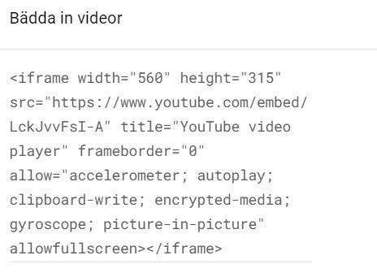
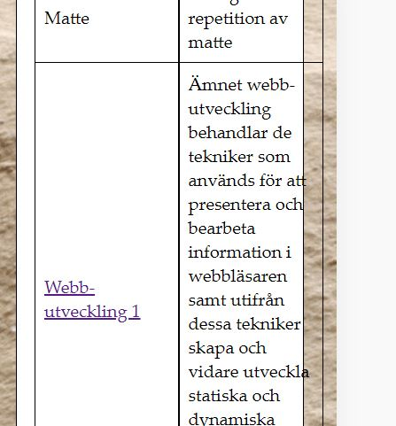

## Projektuppgift

#### Min första inlämning om HTML och CSS.

Jag kommer göra följande HTML-filer som ska slås ihop till en helhet. Alla filer ska innehålla navbar och footer.
* **About:** Här kommer jag skriva om vem jag, intressen, utbildning, arbetshistoria och bilder. Ska även innehålla en "section" tagg med tre "p" (paragraf) taggar.
* **Courses:** Denna sida kommer handla om alla kurser vi läser i utbildningen. Den ska innehålla tabeller med en kort beskrivning av varje kurs samt länk till skolverket.
* **Index:** In kortare beskrivning om min sida. Navbar och footer ska vara synligt.
* **Blogg:** "Mer valfri text" med relevanta rubriker och bilder. 
* **Products:** Här kommer jag lägga upp mina favoriter inom beauty. Med bilder och länkar till respektive hemsida *(länkar ska öppnas i ny flik)*.
* **Other:** Här ska det läggas in en iframe med länk till ett Youtube klipp, relevant text och rubrik. Jag kommer välja temat yoga och avslappning.

Här är en grundplan som jag har tänkt. HTML filerna kommer följa samma tema med samma bakgrundsbild/fonter/färger.

Jag kommer även skriva en "loggbok" i ett word-dokument om det blir förändringar samt de problem jag stöter på och hur jag löser dom.

Kommer även försöka göra commit i GitHub ofta för att jag själv ska kunna följa mitt kodande och ha som dokumentation.

Projektplaneringen kommer ske via Trello.

### September 2021 ###
## Dokumentation ##

Denna inlämning är baserad på 6 punkter där varje punkt innefattar en html-fil och en css-fil.

* Index
* About
* Other
* Blogg
* Courses
* Products

Mer om innehåller kan man läsa i min projektplan i README-filen eller på min Trello sida.

### Utformning/layout
Jag hade från början redan en tanke på hur jag skulle urforma min sida. Det skulle vara samma tema rakt igenom dvs bakgrundsbild, text, färger skulle vara lika på alla sidor. Därför valde jag att lägga allt detta i en egen css-fil som jag döpt till style.css, denna är då länkad till alla mina html-filer. Det som kommer skilja sidorna åt lägger jag i en separat css.fil. Navbar och footer har egna css-filer som är länkade till respektive sida. *(Temat har dock ändrats ett antal gånger under arbetets gång.)*

### Olika enheter
Jag har använt mig av media queries - @media detta är för att min sida ska kunna anpassa sig till olika enheter.
Jag har använt mig av dessa:

**Table**
@media only screen and (min-width: 768px) {

**Desktop** @media only screen and (min-width: 1200px) {

Jag har även varit inne i olika webbläsare för att se hur det ser ut, jag har använt mig av Chrome, Firefox och Microsoft Edge där jag använt mig av desktop, ipad, iphone 6/7/8 plus, iphone 6/7/8.

## Navbar/footer ##
Jag använde mig av w3 schoole för att hitta en lämplig navbar som skulle matcha det resultatet jag ville ha. Men jag stötte på problem när jag satt och designade. "Products" ville inte byta färg när jag klickade på den men man kom in i filen. Efter ett antal försök frågade jag en klasskompis om hjälp, vi delade skärm och kollade igenom min kodning. Det visade sig att jag inte hade ändrat "active" på respektive html-fil. "Products" var alltid "active" på vilken sidan jag än klickade på.

Detta va den första navbaren jag gjorde. Nu har jag tagit bort den och gjort en ny som passar det nya temat jag har valt.

I mobil läget så tryckte navbaren ut sig och tog plats. Så jag va tvungen att ändra till en drop lista istället för att ha den liggandes som i tex desktop.

Till Footer använde jag mig också av w3 schoole för att hitta koderna och designa själv. Även här stötte jag på problem. Eftersom jag till en början hade valt att ha genomskinlig footer med text i, så såg man allt innehåll rulla bakom navbaren vilket inte blev så snyggt. Så jag ändrade till en footer med färg istället. Stötte även på problem här då det inte fanns någon margin mellan footern och innehållet i main. Så jag fick testa mig fram och lägga margin-bottom på respektive sida.

## index.html ##
När man som ny person klickar in sig på min sida så vill jag att man ska kunna få en liten enkel överblick om vad min sida innehåller. Så jag listade upp alla sidorna och skrev en liten förklaring om varje sidas innehåll. Jag tyckte till en början att det såg lite och la in en liten bild.
Jag valde att arbeta i grid och skapa en box med den text som skulle finnas med. Bilden har jag lagt i en .img-responsive { så att den ska minska/öka efter vilket läge jag är inne och tittar i.

## about.html ##
I en tidigare uppgift skulle vi skriva en presentation om oss själva. Den hade jag gjort i flexbox och lagt en css på. Jag hade en tanke att jag skulle använda den i min inlämning. Men när vi gick igenom Grid på en lektion så kändes det enklare att använda sig av den metoden. Dock satte detta käppar i hjulet då jag inte alls fick till designen som jag ville. Jag fick sätta mig och kolla igenom våra inspelningar från lektionerna och läsa på w3 schoole om grid. Efter det va det lite enklare att utforma sidan med colummnerna som jag ville ha dom. Till en början tyckte jag att Flexbox var smidigt men ju mer jag arbetat med Grid så tycker jag nog att det är ett bättre strukturerat arbetssätt eftersom det är fasta element och inte flytande.

## other.html ##
Här skulle vi lägga in iFrame, youtube klipp på vår sidan. Jag gick in på w3 schoole och kopierade den länken som va där. Men jag fick inte in klippet på min sida det va som att länken inte kunde conecta. Tills jag fick tipset att gå in på dela - bädda in.

Då gick det att få in länken på hemsidan. Sedan kunde jag ändra storlek och width som vanligt.

## blogg.html ##
Jag blev osäker på hur en blogg är uppbyggd nu för tiden. Så jag googlade på Pernilla Wahlgrens blogg och kunde få tips på hur jag skulle lägga upp bloggen. Jag valde att lägga inläggen under varandra så det senaste inlägget hamnade högst upp. Annars blir det fel ordning att läsa inläggen i. Så när jag hade gjort klart ett inlägg så kunde jag kopiera den när jag skulle göra flera inlägg.

## courses.html ##
Jag la in alla kurser i en tabell och jag valde att lägga varje termin separat för at få en tydligare överblick. Det såg bra ut i desktop men när jag gick vidare till table och mobile så gick tabellen utanför hela tiden. Jag tog bort och gjorde om tabellen flera gånger men fick samma resultat hela tiden. Jag tog hjälp av Emil och vi delade skärm men vi kom inte hel fram till vad problemet va. Men vi va överens om att orden va för långa och gick utanför tabellen i mobil läget men visste inte hur vi skulle få till det snyggt. Tills jag på en lektion fick hjälp av min lärare att man kan bryta orden med mellanslag eller med ett - då bryts orden. Då blev det äntligen ordning på tabellen i mobil läget. Som jag har irriterat mig på den och testat olika margin, padding, tagit bort celler osv. Men jag märkte att columnen med weeks fortfarande gick utanför. Då fick jag ett bra tips att om man ta bort den columnen enbart i mobil läget så tar det inte lika mycket uttrymme.

## productas.html ##
Här har jag lagt produkterna i tre olika divar med text, bild och länk i varje div. Här bråkade jag en del med att få bilden spegelvänd i den andra diven. Försökte kolla på w3 schoole och våra repetitioner från lektionerna med jag fastnade här. Fick hjälp av Christoffer och han förklarade på ett bra sätt. Här tycker jag fortfarande att grid är lite svårt att förstå sig på. Men ju mer man använder det ju mer sätter sig. Det dök även upp ett annat problem och det var att en av bilderna va för stor jämför med texten. Försökte lösa det med width och .img-responsive { men det hände ingenting med bilden. Tills jag till slut insåg att det är fel bild jag har försökt ändra på Inte konstigt att det inte hände något med den jag ville.

## Slutord ##
Såhär i efterhand så hade jag önskat att vi hade gått igenom grid lite tidigare så man hade fått arbeta in sig mer på det. Jag använde flexbox i about.html men insåg att det blev för krångligt. Så jag fick försöka läsa in mig mer på grid. Det är så lätt att börja med flera saker samtidigt. Så jag ångrar att jag inte från början började strukturera upp hemsidan med grid med hur många columner jag ville ha osv. Jag har gjort om min inlämning säkert 5-6 gånger och raderat allt och börjat om. Senast jag gjorde det va en vecka innan inlämnings datum. Men då började jag strukturera upp det, tog en html i taget och arbeta vidare.

Detsamma gäller när man skulle anpassa från de olika enheterna desktop, table och mobile. Jag har kommit på mig själv flera gånger att jag börjar i desktop och jobbar mig neråt. Men nu på de två sista html-filerna jag gjorde så utgick jag från mobil först och byggde mig uppåt till desktop istället. Det gick lite enklare även om jag fortfarande tycker att det är lite svårt, men jag löser det.

Sen är jag bra på att ha en vision i huvudet på hur jag vill att det ska se ut och strävar ofta efter det. Men denna gången fick jag lägga mig på en nivå som jag mäktar med och med den kunskapen vi har fått. Jag hade gärna lagt till en kommentarsbox i bloggen för att det mer ska likna en blogg, jag hade även ändrat så mina divar hade varit fadade för att få en snyggare layout. Men jag kände någonstans att jag jobbade ihjäl mig och ändrade hur mycket som helst, så jag valde att hålla det enkelt men snyggt.
Nu när jag ser tillbaka så inser jag att jag har lärt mig väldigt mycket genom att göra om och göra rätt. Det har blivit väldigt mycket repetition när jag gjort om allt från grunden flera gånger. Så det har varit lärorikt. Även att jag tillsammans med Aram och Christoffer har kunnat hitta tillfällen att sitta ihop och koda har varit guld värt. Vi har kunnat bolla tankar och lösningar och dom har även fått kolla igenom min kodning och ge feedback.

I det stora hela är jag faktiskt väldigt nöjd med min insatts. Även om det har varit mycket drömande om kodning och endel svordomar. Nu är jag iallafall nöjd med resultatet. 