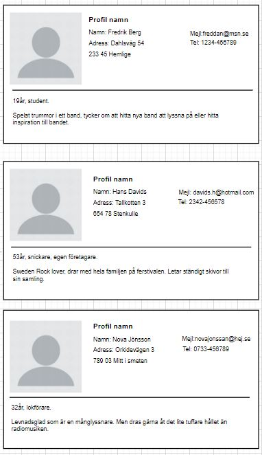

## Dokumentation
Här är min grundidé till min webshop.

En skiss på hur min varukorg. 

Förslag på tre lämpliga personas till webbshopen.

Länk till min projektplanering i Trello finns [Här]('https://trello.com/b/FZWIMc2l/webbutveckling-2')

### Beskriv lite olika lösningar du gjort.

Jag valde att installera React Router Dom@6 för att få in en fungerande navigering istället för att bara använda mig av
en statisk sida med bara album. Detta ger mig möjlighet att orientera mig till olika views som finns på min sida.

Efter att ha bråkat ett antal gånger med useContext så fick jag till mina funktioner med varukorgen. Dom behöver vara
åtkommliga i hela applikationen för att de ska uppdatera. Försökte lägga dom direkt i components men då uppdaterade de
inte helt som det skulle.

Har även lekt lite mer med css på contaktView. Där finns det tre små kort man kan vända på med info. Ville testa att
avancera upp min css. Den css:en hittade jag på w3 och ville lägga in den på min sida.

### Beskriv något som var besvärligt att få till.

Jag har haft stora bekymmer med att förstå hur useContext fungerar. Har kollat många gånger på inspelningarna samt
youtubeklipp men det sätter sig inte. Jag tog hjälp av min klasskamrat Ursula så vi har suttit ihop och försökt oss på
hur useContext fungerar.

Även funktionerna till varukorgen har jag haft problem med. Jag tog hjälp av min svåger Linus som har väglett mig till
att översätta de gamla funktionerna från Programmering 1. Vi stötte även på endel problem med useContext där också. Han
har även försökt handleda mig genom att ställa frågor kring hur jag tänker och hur jag vill bygga min kod. Han har även
satt mig på pottkanten ett antal gånger och jag har kännt mig helt borta.

Jag tycker fortfarande att det är svårt att koppla det logiska tänket om vilka variabler som hör ihop, vad som propsas
osv. Det känns som det är skrap på ytan, hade behövt grotta ner mig mer för att förstå exakt hur det hänger ihop.

### Beskriv om du fått byta lösning och varför i sådana fall.

I början så använde jag mig inte av css modules vilket jag snabbt blev varse att jag ville ha. Upptäckte att min css
läckte över i andra komponenter.

### Beskriv hur du felsökt ditt program när det uppstått problem

React är bra på att tala om när något är fel, man får stora röda bokstäver med Error och även vilken rad som är fel.
Ibland blir det svårare att hitta fel om sidan blir helt vit istället. Jag har alltid haft consolen uppe i webläsaren
för då ser jag direkt om det uppstår något fel.

När varukorgen skulle fixas va console.log väldigt hjälpsama. Vid några tillfällen så ville den inte uppdatera i input
den visade 0 tex, eller att min arrey med album va tom. Då kunde jag ta hjälp av den för att se vad den innehöll.

### Vad gick bra

Jag tycker att jag lyckats få till en bra sida med ux/ui. Forma och bygga en sida har jag enklare för än att tänka det
logiska i att koppla ihop hela säcken med funktionallitet.

### Vad gick dåligt

Ingenting har väl gått dåligt, det är bara det att jag fortfarande har svårt att se hur allt hänger ihop. Jag har
arbetat ihop med Christoffer och Aram och när jag har haft en tanke om hur det kanske kan hänga ihop och försökt
förklara hur jag tänker så är inte feedbacken alltid så stor. Troligen för att vi alla sitter i samma båt och har
ungefär samma problem/kunskap. Har försökt vända på varje sten för att hitta ett sätt för att få större förståelse.
Därför tog jag kontakt med min svåger som förklarade på ett annat sätt. Inte för att jag kopplar helt än, men jag tror
jag behöver sitta mer för att det ska poletten ska trilla ner.

### Vad har du lärt dig

Jag har lärt mig att Routing är det man behöver för att få en navigering att fungera på en hemsida.Det va helt nytt för
mig, det skiljer sig verkligen från vanilla HTML.

Har även lärt mig useState [open, setOpen] = useState att det sparar och uppdaterar ett värde.

Det är även enklare att skriva ut saker från en funktion tex. man använder sig av {open}, väldigt mycket enklare en
document.getelementbyId.'

Sen förstår jag ju att useContext/provider lägger sig globalt och att man har tillgång till sina funktioner/useState i
hela applikationen. Men mer än så har jag inte helt förstått.

Props är något nytt för mig. Det verkar smidigt att man kan ta med sig saker från en komponent till en annan och lägger
man det innanför en annan tag så blir det en "children".

### Vilka möjligheter ser du med de kunskaper du fått under kursen.

Jag ser ju att det finns stor potential i React. Det är ett populärt bibliotek på arbetsmarknaden. Jag tror att sätter
man sig in i det mer så blir det nog enklare att bygga hemsidor framöver. Men återigen går vi bara igenom saker på ytan,
så det är svårt att koppla allt hur det hänger ihop.

### Motivera varför du valt en specifik lösning.

Jag jag nämt ovan så valde jag att lägga till Routing så man kan navigera sig till olika sidor. Detta gjorde jag gör att
dels träna på Routingen men även för att få en helhets bild av webbsidan.

### Lämna förslag på förbättringar av din kod.

Jag behöver se över min css, jag tror att det kan ligga lite dubbelt. Det finns nog css i de andra filerna som kan ligga
i de globala istället.

Jag är övertygad om att man kan skriva koden enklare och med mindre rader i mina funktioner. Men jag har inte den
kunskapen känner jag. Har försökt översätta från min kod från Programmering 1.

### Lämna exempel på lösningar du valde att inte implementera

Jag förökte mig på en searchbox, men efter att ha kollat på inspelningarna så lyckades jag inte inplementera det i min
egen kod. Nu ligger min datafil lokalt, tidigare har vi använt oss av api och axios. Om jag förstår det rätt så ska man
kunna importera datafilen och sedan använda filter. Men jag lyckades inte pussla ihop alla bitarna så nu ligger den där
enbart för syns skull.

### Lämna förslag på förbättringar av din UI/UX design eller reflektera över den.

Jag är nöjd med mitt val av UI/UX. Jag har försökt fånga färger som finns i albumen. Utöver det tycker jag att sidan är
lugn, behaglig och enkel i sin helhet. 